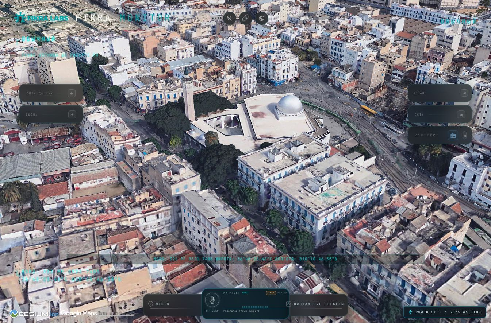
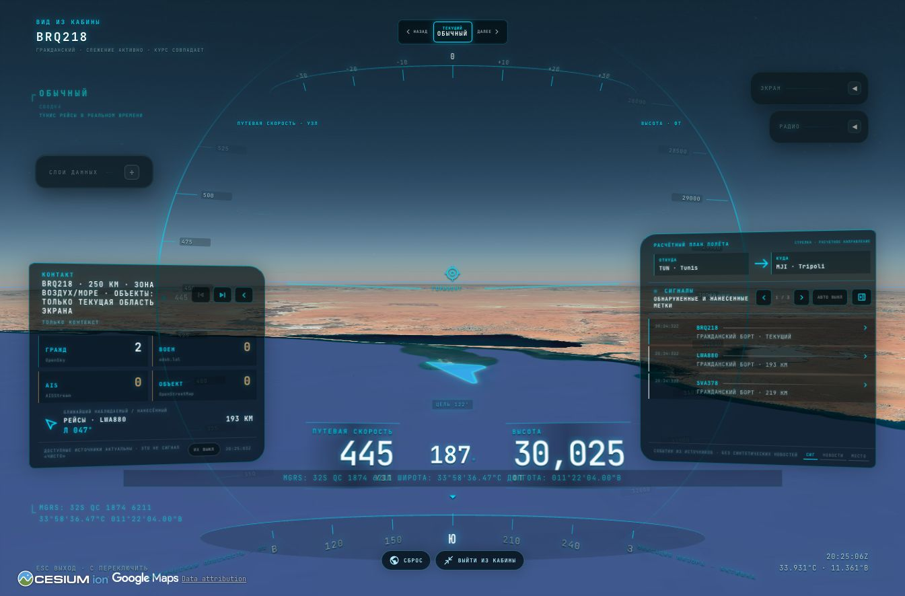
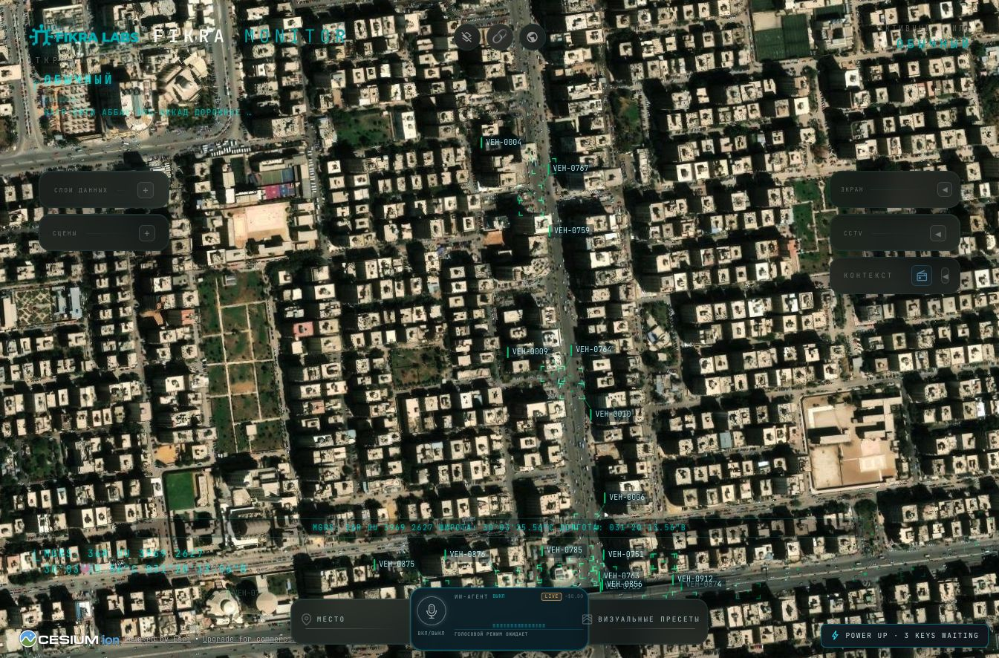

# Fikra Monitor

Русскоязычный форк [God's Eye View](https://github.com/bilawalsidhu/gods-eye-view) для исследования открытых геоданных на интерактивном глобусе. Исходный проект создан Bilawal Sidhu; его [подробный обзор возможностей](https://github.com/bilawalsidhu/gods-eye-view#readme) доступен в исходном репозитории. Код распространяется по MIT с сохранением авторского уведомления; данные, модели и медиа имеют отдельные условия, перечисленные в [LICENSE](LICENSE), [DATA_SOURCES.md](DATA_SOURCES.md), [public/models/README.md](public/models/README.md) и [docs/media/README.md](docs/media/README.md).

Опциональный голосовой режим по умолчанию использует GPT-Live 1 для диалога и GPT-5.6 Luna для команд карте и поиска. Нужен собственный `OPENAI_API_KEY`.

Проект показывает открытые сигналы, а не достоверную оперативную картину. Полёты, суда, спутники, землетрясения, пожары и публичные камеры могут быть задержаны или неполны; часть движения и ракурсов моделируется. Не используйте его для навигации, чрезвычайных ситуаций или иных решений, где важна безопасность.

[English](README.en.md) · [Подробная установка](docs/setup.ru.md) · [Безопасность](SECURITY.md) · [Источники данных](DATA_SOURCES.md) · [Проверка релиза](docs/release-audit-2026-09-13.md)

## Как выглядит

Скриншоты работающего Fikra Monitor с русским интерфейсом. Для показанных Google 3D и дорожного потока TomTom нужны собственные ключи провайдеров; базовая карта запускается без них.

### Тунис: мечеть Аль-Фатх в 3D

Фотореалистичная геометрия мечети и окружающих кварталов из Google Photorealistic 3D Tiles. Это картографические данные, не прямая видеотрансляция.



### Полёт: вид из кабины

Виртуальное сопровождение рейса BRQ218 по открытым полётным данным. Камера и план полёта моделируются приложением, это не изображение из настоящей кабины.



### Каир: дорожное движение в Наср-Сити

Улица Аббас-эль-Аккад на спутниковой подложке Esri с визуализацией потока TomTom. Движущиеся маркеры иллюстрируют поток, а не положение или точное количество реальных автомобилей.



## Быстрый запуск

Нужны Git и Node.js **24.14+ серии 24 LTS** (поддерживается также совместимая серия 26; точное условие см. в `package.json`). Ключи и файл `.env` для первого запуска не нужны. Встроенный глобус использует доступные без ключей источники изображений и карт; Google 3D и часть функций включаются отдельно.

Исходный код форка: [github.com/fikra-labs-official/fikra-monitor](https://github.com/fikra-labs-official/fikra-monitor).

```bash
git clone https://github.com/fikra-labs-official/fikra-monitor.git
cd fikra-monitor
npm ci
npm run doctor
npm run dev
```

Откройте [http://127.0.0.1:4173](http://127.0.0.1:4173). Для остановки нажмите `Ctrl+C` в том же терминале. Чтобы запустить снова, выполните `npm run dev` из папки проекта. На Windows используйте команды PowerShell из [подробной инструкции](docs/setup.ru.md).

## Что доступно

- Без дополнительных ключей: базовые карты, часть данных о самолётах, спутниках и землетрясениях, доступные публичные камеры, радио, некоторые статические слои. Наличие данных зависит от внешних сервисов и региона.
- По желанию: Google Photorealistic 3D Tiles, поиск мест и геокодирование; Cesium ion для отдельных карт/рельефа; OpenAI для голосового управления и AI HUD; AISStream для судов; NASA FIRMS для пожаров; TomTom для реального дорожного потока. Без TomTom дорожные точки обозначают моделирование, а не живые пробки.
- Дополнительно: OpenSky OAuth может улучшить доступ к полётным данным; Launch Library 2 и TfL работают и без ключа, но могут иметь более строгие лимиты.

На локальном **dev-сервере** справа внизу есть панель **POWER UP / Provider Settings**. Ссылка **GET KEY** ведёт к регистрации у провайдера. Сохранение ключа записывает его в локальный `.env` этого проекта (при запуске через Pinokio — в `pinokio/ENVIRONMENT`) и перезапускает dev-сервер. Ключи, пришедшие из переменных окружения или Keychain, показаны как внешние и не меняются из панели. В `npm run preview` панель недоступна. Альтернатива: заполнить личный `.env` по `.env.example` и перезапустить сервер. [Где получить каждый ключ](docs/setup.ru.md#3-ключи-и-аккаунты).

## Рекомендуемая голосовая связка

Наш рекомендуемый вариант с одним предоставленным вами `OPENAI_API_KEY`: [GPT-Live 1](https://developers.openai.com/api/docs/models/gpt-live-1) ведёт двусторонний голосовой диалог (full-duplex), а [GPT-5.6 Luna](https://developers.openai.com/api/docs/models/gpt-5.6-luna) через Responses получает делегированные [команды карте, поиск и сложные рассуждения](https://developers.openai.com/api/docs/guides/live-delegation). Текущий голосовой движок по умолчанию — `live`: русский мужской голос `meridian`, без видимого транскрипта. После изменения конфигурации перезапустите dev-сервер и проверьте индикатор **LIVE**. Для прежнего режима задайте `OPENAI_VOICE_ENGINE=realtime`.

Это наш выбор для проекта, а не доказательство превосходства в бенчмарках или самый дешёвый вариант. GPT-Live 1 стоит $0.05/мин, включая тишину; использование Luna оплачивается отдельно. Автозакрытие голосовой сессии браузером через 600 секунд — настройка приложения, не лимит провайдера. Сверяйте [актуальные цены](https://developers.openai.com/api/docs/pricing) перед использованием.

Luna выбрана для экономичных команд карте. Для неоднозначных запросов и длинных цепочек действий Terra может оказаться надёжнее; точной разницы качества на ваших сценариях пока не измеряли. При одинаковом количестве токенов Luna в 10 раз дешевле Terra, но стоимость самого Live не меняется. Чтобы вручную выбрать Terra, задайте `OPENAI_LIVE_BACKEND_MODEL=gpt-5.6-terra` в личном `.env` и перезапустите сервер. Автоматического перехода на более дорогую модель нет.

## Важное о ключах и расходах

`GOOGLE_MAPS_API_KEY` и `CESIUM_ION_TOKEN` передаются в браузер и **видны в инструментах разработчика**. Ограничивайте их доступными у провайдеров средствами. Отдельный `GOOGLE_MAPS_SERVER_API_KEY` предпочтителен для серверных Places API (New), Geocoding API и Street View Static API: держите его приватным, ограничивайте по API и не полагайтесь на постоянный исходящий IP ноутбука. Остальные секреты (`OPENAI_API_KEY`, `AISSTREAM_API_KEY`, `FIRMS_MAP_KEY` и т. д.) остаются на локальном сервере, но локальные клиенты могут расходовать квоты. Форк намеренно поддерживает только loopback, без доступа из LAN и публичного хостинга.

Google Maps Platform и OpenAI API оплачиваются отдельно от подписки ChatGPT. Проверьте [текущие цены OpenAI API](https://developers.openai.com/api/docs/pricing), тарифы и квоты остальных провайдеров; настройте ограничения и оповещения до длительного использования. Встроенные оценки/лимиты приложения не являются гарантированным ограничением счёта. Никогда не публикуйте `.env`, ключи, диагностические журналы и скриншоты с секретами.

## Проверка и участие

```bash
npm run build
npm test
npm run check:publication
```

Отдельно запустите `npm run preview` для локального просмотра сборки; остановите его `Ctrl+C`. Проверка публикации анализирует **текущее рабочее дерево и индекс** на типовые приватные файлы и ключи. Она **не гарантирует**, что секретов нет в прежних Git-коммитах. Эти команды также не подтверждают работу браузера, провайдеров и свежесть данных. Для предложений и исправлений см. [CONTRIBUTING.md](CONTRIBUTING.md). Сведения об уязвимостях передавайте приватно по [SECURITY.md](SECURITY.md).

Этот форк не является официальной службой Google, Cesium, OpenAI, NASA или других источников. Сохраняйте атрибуцию в приложении и проверяйте лицензии источников перед распространением или коммерческим использованием.
